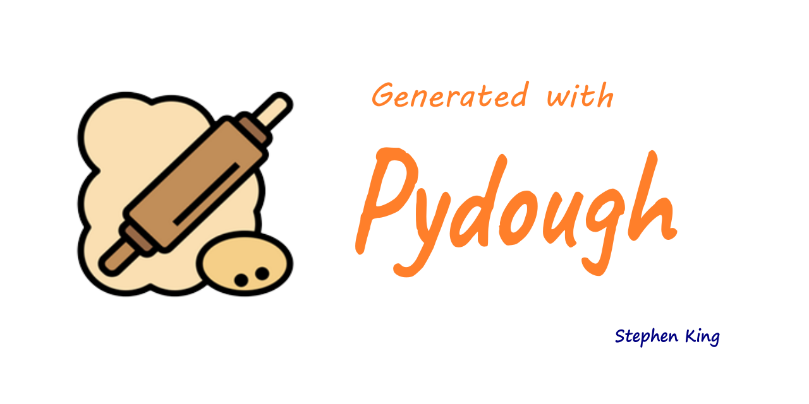

# {{ cookiecutter.project_name }}

> Short blurb about what your product does.

[![PyPI][pypi-image]][pypi-url]
[![Downloads][downloads-image]][downloads-url]
[![Status][status-image]][pypi-url]
[![Python Version][python-version-image]][pypi-url]
[![tests][tests-image]][tests-url]
[![Codecov][codecov-image]][codecov-url]
[![CodeQl][codeql-image]][codeql-url]

[![Docker][docker-image]][docker-url]


[![pre-commit][pre-commit-image]][pre-commit-url]
[![pre-commit.ci status][pre-commit.ci-image]][pre-commit.ci-url]

[![readthedocs][readthedocs-image]][readthedocs-url]
[![CodeFactor][codefactor-image]][codefactor-url]
[![Codeclimate][codeclimate-image]][codeclimate-url]

[![Imports: isort][isort-image]][isort-url]


[![Code style: black][black-image]][black-url]


[![Checked with mypy][mypy-image]][mypy-url]


[![security: bandit][bandit-image]][bandit-url]


[![Commitizen friendly][commitizen-image]][commitizen-url]

[![Conventional Commits][conventional-commits-image]][conventional-commits-url]
[![Versioning][versioning-image]][versioning-url]
[![DeepSource][deepsource-image]][deepsource-url]
[![license][license-image]][license-url]
[![Pydough][pydough-image]][pydough-url]

[![OpenSSFScorecard][openssf-image]][openssf-url]


One to two paragraph statement about your product and what it does.




# Contents

-   [Demo](#-demo)
-   [Project rationale](#-project-rationale)
-   [Quick start](#-quickstart)
    -   [Prerequisites](#-prerequisites)
    -   [Installation](#-installation)
    -   [Basic Usage](#-basic-usage)
-   [Usage](#-usage)
-   [Development setup](#-development-setup)
-   [Configuration](#-configuration)
-   [Documentation](#-documentation)
    -   [Read the Docs](https://pynamer.readthedocs.io/en/latest/)
    -   [API](https://pynamer.readthedocs.io/en/latest/autoapi/pynamer/pynamer/index.html)
    -   [Wiki](https://github.com/Stephen-RA-King/pynamer/wiki)
-   [FAQs](#-faqs)
-   [What's new in version x.x](#-whats-new-in-version-xx)
-   [Planned future enhancements](#-planned-future-enhancements)
-   [Package statistics](#-package-statistics)
-   [License](#-license)
-   [Meta information](#ℹ-meta)


# 📺 Demo

---

Put a demo animated gif here.


# 💡 Project rationale

---

Why I built this project


## 👓 TLDR

A very succinct paragraph summary regarding the package purpose and operation.


# 🚀 Quickstart

---

Explain succinctly how to use the repository

## 📋 Prerequisites

- A bulleted list of requirements


## 💾 Installation


OS X & Linux:

```sh
pip3 install {{ cookiecutter.project_name }}
```

Windows:

```sh
pip install {{ cookiecutter.project_name }}
```

## 📝 Basic Usage

A simple example demonstrating that the package is working


# 📝 Usage

---

A few motivating and useful examples of how your product can be used. Spice this up with code blocks and potentially more screenshots.

_For more examples and usage, please refer to the [Wiki][wiki]._

# 🔧 Development setup

---

Describe how to install all development dependencies and how to run an automated test-suite of some kind. Potentially do this for multiple platforms.

```sh
pip install --editable {{ cookiecutter.project_name }}
```

# ⚙️ Configuration

---

Place configuration information here


# 🔒 Security Considerations

---

Write any security concerns that you may have here.
e.g. exposure of API keys, passwords, old modules etc.


# 📚 Documentation

---

[**Read the Docs**](https://{{ cookiecutter.project_name }}.readthedocs.io/en/latest/)

- [**Example Usage**](https://{{ cookiecutter.project_name }}.readthedocs.io/en/latest/example.html)
- [**Credits**](https://{{ cookiecutter.project_name }}.readthedocs.io/en/latest/example.html)
- [**Changelog**](https://{{ cookiecutter.project_name }}.readthedocs.io/en/latest/changelog.html)
- [**API Reference**](https://{{ cookiecutter.project_name }}.readthedocs.io/en/latest/autoapi/index.html)


[**Wiki**](https://github.com/{{ cookiecutter.github_username  }}/{{ cookiecutter.project_name }}/wiki)

# 🧬 Design Considerations

---

A few paragraphs on the design considerations if required.


# 🐳 Using Docker

---

## Building the Image from Dockerfile

Start your docker runtime then:

Build the image using ***docker build*** command. e.g.


```shell
$ docker build -t {{ cookiecutter.docker_hub_username }}/{{ cookiecutter.project_name }}:{{ cookiecutter.version }} -t {{ cookiecutter.docker_hub_username }}/{{ cookiecutter.project_name }}:latest .
```

Once built, run the image using the ***docker run*** command.  This will create the container. e.g.

```shell
$ docker run -it {{ cookiecutter.docker_hub_username }}/{{ cookiecutter.project_name }}:{{ cookiecutter.version }} /bin/bash
```

Optional: The image can now be pushed to the repository using the ***docker push*** command. e.g.

```shell
$ docker push {{ cookiecutter.docker_hub_username }}/{{ cookiecutter.project_name }}:{{ cookiecutter.version }}
```

## Using the ready built image on dockerhub

Pull the latest image from the repository using the ***docker pull*** command. e.g.

```bash
~ $ docker pull {{ cookiecutter.docker_hub_username }}/{{ cookiecutter.project_name }}
```

Now run the image using the ***docker run*** command.  This will create the container. e.g.

```bash
~ $ docker run -it {{ cookiecutter.docker_hub_username }}/{{ cookiecutter.project_name }} /bin/bash
```

Use the command line as normal in the container.

```bash
root@4d315992ca28:/app# {{ cookiecutter.project_name }} -h
```


# ⚠️ Limitations

---

Describe any limitation the application may have (if any).

# ⁉️ Some Quirks

---

The reason I wrote this application in the first place.


## ❓ FAQs

---

Give examples of frequently asked questions


# 📰 What's new in version x.x

---

- bulleted list of new features

# 📆 Planned future enhancements

---

- Feature 1
- Feature 2


# 📊 Package statistics

---

- [**libraries.io**](https://libraries.io/pypi/{{ cookiecutter.github_username }})
- [**PyPI Stats**](https://pypistats.org/packages/{{ cookiecutter.github_username }})
- [**Pepy**](https://www.pepy.tech/projects/{{ cookiecutter.github_username }})


# 📜 License

---

Distributed under the {{cookiecutter.license}} license. See [![][license-image]][license-url] for more information.


# <ℹ️> Meta

---


[](https://www.linkedin.com/in/sr-king)

[](https://github.com/{{ cookiecutter.github_username }})
[](https://pypi.org/project/{{ cookiecutter.project_name }})

[](https://hub.docker.com/r/{{ cookiecutter.docker_hub_username }}/{{ cookiecutter.project_name }})


[](https://stephen-ra-king.github.io/justpython/)

[](mailto:{{ cookiecutter.email }})
[](https://github.com/{{ cookiecutter.github_username }}/{{ cookiecutter.project_name }})


Author: {{cookiecutter.author_name}} ([{{cookiecutter.email}}](mailto:{{cookiecutter.email}}))

Created with Cookiecutter template: [![pydough][pydough-image]][pydough-url]


Digital object identifier: [](https://zenodo.org/badge/latestdoi/xxxxxxxxx)



<!-- Markdown link & img dfn's -->


[bandit-image]: https://img.shields.io/badge/security-bandit-yellow.svg
[bandit-url]: https://github.com/PyCQA/bandit


[black-image]: https://img.shields.io/badge/code%20style-black-000000.svg
[black-url]: https://github.com/psf/black

[codeclimate-image]: https://api.codeclimate.com/v1/badges/7fc352185512a1dab75d/maintainability
[codeclimate-url]: https://codeclimate.com/github/{{cookiecutter.github_username}}/{{cookiecutter.project_name}}/maintainability
[codecov-image]: https://codecov.io/gh/{{cookiecutter.github_username}}/{{cookiecutter.project_name}}/branch/main/graph/badge.svg
[codecov-url]: https://app.codecov.io/gh/{{ cookiecutter.github_username }}/{{ cookiecutter.project_name }}
[codefactor-image]: https://www.codefactor.io/repository/github/Stephen-RA-King/{{ cookiecutter.project_name }}/badge
[codefactor-url]: https://www.codefactor.io/repository/github/Stephen-RA-King/{{ cookiecutter.project_name }}
[codeql-image]: https://github.com/Stephen-RA-King/{{ cookiecutter.project_name }}/actions/workflows/github-code-scanning/codeql/badge.svg
[codeql-url]: https://github.com/Stephen-RA-King/{{ cookiecutter.project_name }}/actions/workflows/github-code-scanning/codeql

[commitizen-image]: https://img.shields.io/badge/commitizen-friendly-brightgreen.svg
[commitizen-url]: http://commitizen.github.io/cz-cli/

[conventional-commits-image]: https://img.shields.io/badge/Conventional%20Commits-1.0.0-yellow.svg?style=flat-square
[conventional-commits-url]: https://conventionalcommits.org
[deepsource-image]: https://app.deepsource.com/gh/Stephen-RA-King/{{ cookiecutter.project_name }}.svg/?label=active+issues&show_trend=true
[deepsource-url]: https://app.deepsource.com/gh/Stephen-RA-King/{{ cookiecutter.project_name }}/?ref=repository-badge

[docker-image]: https://github.com/Stephen-RA-King/{{ cookiecutter.project_name }}/actions/workflows/docker-image.yml/badge.svg
[docker-url]: https://github.com/Stephen-RA-King/{{ cookiecutter.project_name }}/actions/workflows/docker-image.yml

[downloads-image]: https://static.pepy.tech/personalized-badge/{{cookiecutter.project_name}}?period=total&units=international_system&left_color=black&right_color=orange&left_text=Downloads
[downloads-url]: https://pepy.tech/project/{{cookiecutter.project_name}}
[format-image]: https://img.shields.io/pypi/format/{{ cookiecutter.project_name }}

[isort-image]: https://img.shields.io/badge/%20imports-isort-%231674b1?style=flat&labelColor=ef8336
[isort-url]: https://github.com/pycqa/isort/

[license-image]: https://img.shields.io/pypi/l/{{cookiecutter.project_name}}
[license-url]: https://github.com/{{ cookiecutter.github_username }}/{{ cookiecutter.project_name }}/blob/main/LICENSE

[mypy-image]: http://www.mypy-lang.org/static/mypy_badge.svg
[mypy-url]: http://mypy-lang.org/


[openssf-image]: https://api.securityscorecards.dev/projects/github.com/Stephen-RA-King/{{ cookiecutter.project_name }}/badge
[openssf-url]: https://api.securityscorecards.dev/projects/github.com/Stephen-RA-King/{{ cookiecutter.project_name }}


[pre-commit-image]: https://img.shields.io/badge/pre--commit-enabled-brightgreen?logo=pre-commit&logoColor=white
[pre-commit-url]: https://github.com/pre-commit/pre-commit
[pre-commit.ci-image]: https://results.pre-commit.ci/badge/github/Stephen-RA-King/{{ cookiecutter.project_name }}/main.svg
[pre-commit.ci-url]: https://results.pre-commit.ci/latest/github/Stephen-RA-King/{{ cookiecutter.project_name }}/main

[pydough-image]: https://img.shields.io/badge/Cookiecutter-pydough-orange?logo=cookiecutter
[pydough-url]: https://github.com/Stephen-RA-King/pydough
[pypi-url]: https://pypi.org/project/{{ cookiecutter.project_name }}/
[pypi-image]: https://img.shields.io/pypi/v/{{cookiecutter.project_name}}.svg
[python-version-image]: https://img.shields.io/pypi/pyversions/{{cookiecutter.project_name}}
[readthedocs-image]: https://readthedocs.org/projects/{{ cookiecutter.project_name }}/badge/?version=latest
[readthedocs-url]: https://{{ cookiecutter.project_name }}.readthedocs.io/en/latest/?badge=latest
[status-image]: https://img.shields.io/pypi/status/{{cookiecutter.project_name}}.svg
[tests-image]: https://github.com/{{cookiecutter.github_username}}/{{cookiecutter.project_name}}/actions/workflows/tests.yml/badge.svg
[tests-url]: https://github.com/{{cookiecutter.github_username}}/{{cookiecutter.project_name}}/actions/workflows/tests.yml
[versioning-image]: https://img.shields.io/badge/versioning-semver_2-blue
[versioning-url]: https://semver.org/
[wiki]: https://github.com/{{ cookiecutter.github_username }}/{{ cookiecutter.project_name }}/wiki

